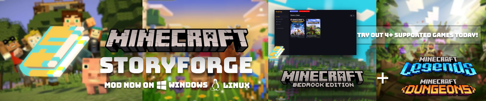
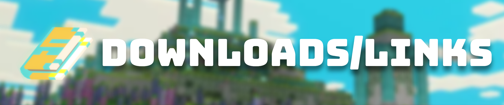
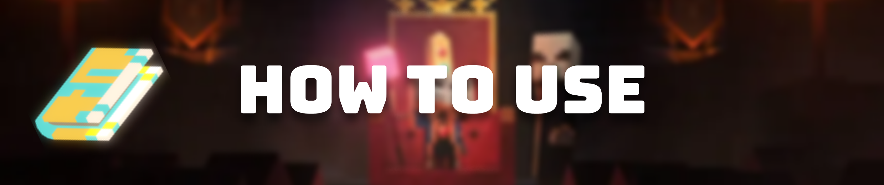
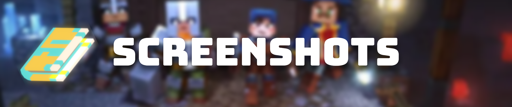
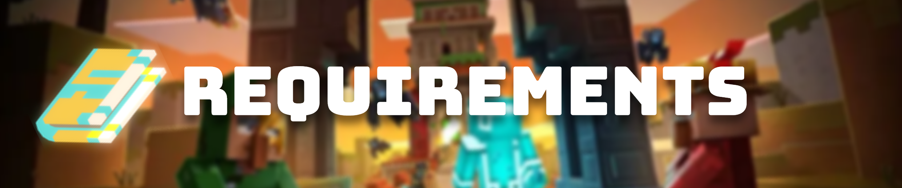

# StoryForge Launcher

Legal @2026

### Version: v1.0+ (C#) FULL

Here's an open-source Launcher + Mod Editer just for MC games! Made by (@B0Zin0)

> A sleek, modern launcher for **Minecraft: Story Mode** Season 1 & Season 2, Minecraft: Legends, Minecraft: Dungeons, and Minecraft: Bedrock.  
> Built in C# + WPF.

---
## Updates!

## PLEASE VIEW THE "StoryForge_IntroGuide" video in order to see EVERYTHING we have to offer! 
Watch here: https://youtu.be/INqvNz9rKD0

---

## Downloads/Links

***[MCSM Mods](https://gamebanana.com/search?_sOrder=best_match&_sSearchString=minecraft+story+mode)***
> Game Banana offers plenty of mods that are supported with StoryForge!

***[StoryForge v1.20.1](https://b0zin0.github.io/)***
> A sleek, modern launcher for **Minecraft: Story Mode** Season 1 & Season 2, Minecraft: Legends, Minecraft: Dungeons, and Minecraft: Bedrock.  

***[MCSM S1](aHR0cHM6Ly9zdGVhbXJpcC5jb20vbWluZWNyYWZ0LXN0b3J5LW1vZGUtY29tcGxldGUtc2Vhc29uLTJxLw==)***
> .exe of the FULL season 1 + 3 extra episodes from the "Adventure Pass". (Base64)

***[MCSM S2](aHR0cHM6Ly9zdGVhbXJpcC5jb20vbWluZWNyYWZ0LXN0b3J5LW1vZGUtc2Vhc29uLXR3by1mcmVlLWRvd25sb2FkLTJ3Lw==)***
> .exe of the FULL season 2. (Base64)
---

## Features

- One-click launch for Season 1 & Season 2, Minecraft: Legends, Minecraft: Dungeons, and Minecraft: Bedrock.  
- Mod manager — install, view, and remove mods for ANY game.
- Settings page — set your game paths, toggle music, auto check paths & more!
- Frameless custom window with drag support + Optimized speed & RAM usage
- And even more so check it out! 

---

## How to Use

1. Download the latest release from the link/links above.
2. Extract the zip — keep `StoryForge.exe`
3. Run `StoryForge.exe`
4. Click **Settings** and point each season to its `.exe` file and/or Check on Auto ste paths.
5. Click any season to launch the game itself!
  < Thank you for all the support!
---

## Screenshots

TBA

---

## Requirements

- Windows 10 or 11 (64-bit) or linux (any version)
- No install required — fully self-contained

## Credits

Made by **B0zin0/Bozino**  
Credits to Telltale Modding Group for the Telltale-Script-Editor,
iMrShadow for the Texture Tool! 
and many many more!

< StoryForge is an open-source fan project. It is not affiliated with, endorsed by, or sponsored by Telltale Games, Mojang, or Microsoft. Minecraft: Story Mode and all related names are trademarks of their respective owners.
